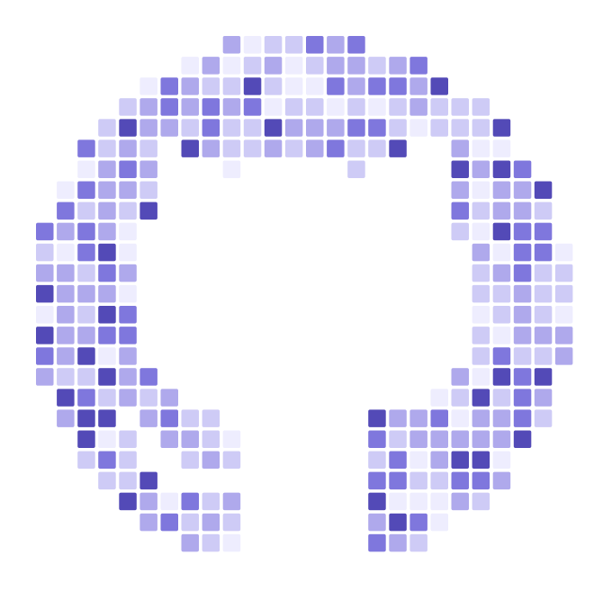
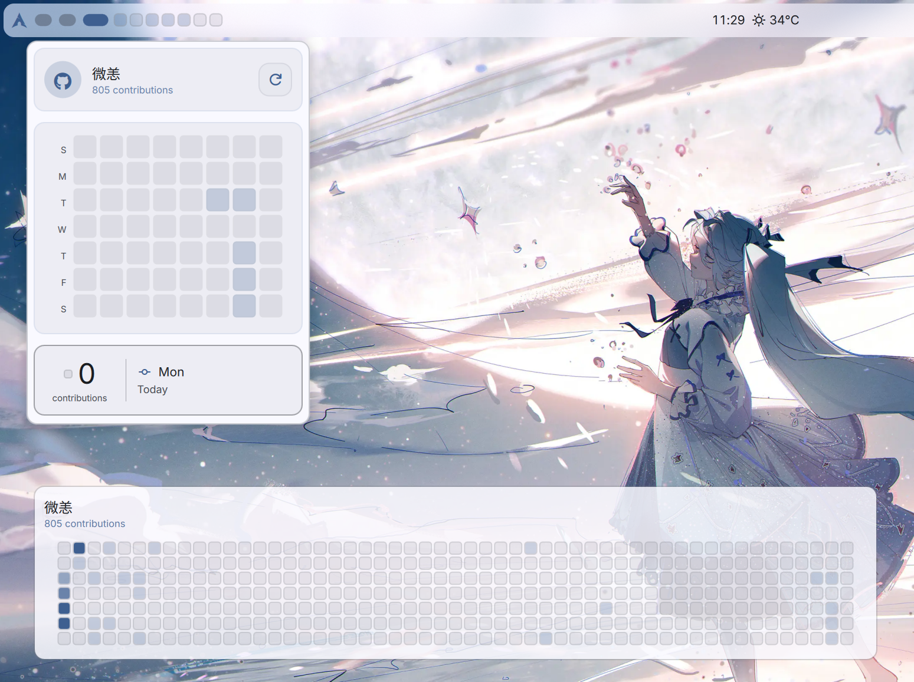

<div align="center">

<a href="https://github.com/maxlen727/DMS-GitHub_HeatMap_Plus">
    
</a>

# GitHub Heatmap Plus

### A Beautiful GitHub Contribution Heatmap for Dank Material Shell

[](https://github.com/AvengeMedia/DankMaterialShell)
[](https://danklinux.com/docs/dankmaterialshell/plugin-development#composite-plugins)
[](https://github.com/maxlen727/DMS-GitHub_HeatMap_Plus)

</div>

## Screenshots

<div align="center">
  
</div>

## Features

- **DankBar Widget** — A compact pill in your DankBar showing your last 7 days of activity (or just today in compact mode). Click to expand a popout calendar with an interactive detail card showing the exact date and contribution count for any day.
- **Desktop Widget** — A resizable card on your desktop that intelligently adapts its layout: compact 7-day strip when small, full 8-week calendar grid when large.
- **Theme-Aware Colors** — Choose between the classic GitHub green heatmap or follow your DMS accent color for a seamless look that matches your desktop theme.
- **Light & Dark Mode** — First-class support for both light and dark mode, with carefully tuned color palettes for each.
- **Display Name Support** — Show your GitHub profile's display name instead of your username for a more personal touch.
- **Granular Settings** — Fine-tune every aspect: square size, spacing, background opacity, refresh rate, compact mode, and more.

## DankBar Widget

The DankBar widget sits in your top bar and provides at-a-glance activity tracking.

<div align="center">
  
</div>

- **7-day pill** — see your last week of contributions at a glance
- **Compact mode** — toggle to show only today's square for a minimal look
- **Popout calendar** — click to expand a full 8-week heatmap with interactive day detail

## Desktop Widget

The desktop widget adapts to whatever size you give it.

<div align="center">
  <table>
    <tr>
      <td align="center"><br/><b>Mini</b></td>
      <td align="center"><br/><b>Small</b></td>
      <td align="center"><br/><b>Full</b></td>
    </tr>
  </table>
</div>

- The widget automatically shows fewer weeks if the space is too small for a full year
- Adjustable background opacity to blend with your wallpaper

## Configuration

Settings are shared between the DankBar widget and the desktop widget.

<div align="center">
  
  &nbsp;&nbsp;
  
</div>

### GitHub Account & Sync

| Setting | Description |
|---------|-------------|
| **GitHub Identity** | Your GitHub username used to fetch public contribution data |
| **Show Display Name** | Show your profile's display name instead of your username |
| **Refresh Rate** | How often to sync (in seconds). Higher values save battery |
| **System Alerts** | Show desktop notifications for sync status |
| **Follow DMS Theme Color** | Use your DMS accent color instead of classic GitHub green |

### DankBar Widget

| Setting | Description |
|---------|-------------|
| **Compact Mode** | Show only today's square instead of the last 7 days |
| **Square Size** | Size of each contribution square (in px) |
| **Spacing** | Gap between squares (in px) |

### Desktop Widget

| Setting | Description |
|---------|-------------|
| **Background Opacity** | How solid the card background looks |
| **Square Size** | Size of each contribution square (in px) |
| **Square Spacing** | Gap between squares (in px) |

## Installation

```bash
git clone https://github.com/maxlen727/DMS-GitHub_HeatMap_Plus ~/.config/DankMaterialShell/plugins/githubHeatmapPlus
```

Then: **Settings > Plugins > enable "GitHub Heatmap Plus"**.

Composite plugins don't auto-load — add the bar widget from the DankBar layout editor, and/or right-click the desktop to place the desktop widget, as usual.

## Architecture

This is a [composite DMS plugin](https://danklinux.com/docs/dankmaterialshell/plugin-development#composite-plugins) (requires DMS >= 1.5.0): one `plugin.json`, one settings namespace, two independent surfaces.

```
plugin.json
components/
  BarWidget.qml          # DankBar pill + popout calendar
  DesktopWidget.qml      # Resizable desktop card
  Settings.qml           # Shared settings for both surfaces
assets/
  icons/commit.svg       # Plugin icon
```

The desktop widget reads cached contribution data from the bar widget via `savePluginData`/`loadPluginData`, and stays live through `PluginService.globalVarChanged`. No duplicate API requests between the two surfaces — the bar widget must be enabled and have fetched at least once before the desktop widget has data to show.

## Credits

This project builds upon the work of [JDKamalakar/DMS-GitHub_HeatMap](https://github.com/JDKamalakar/DMS-GitHub_HeatMap). Huge thanks to **JDKamalakar** for the original implementation that inspired this project. The codebase has been substantially rewritten and expanded with new features, theme support, and a composite plugin architecture.

Built for the [Dank Material Shell](https://github.com/AvengeMedia/DankMaterialShell) community.

## License

Part of the DankMaterialShell plugin ecosystem. Check the main repository for license information.

</div>
